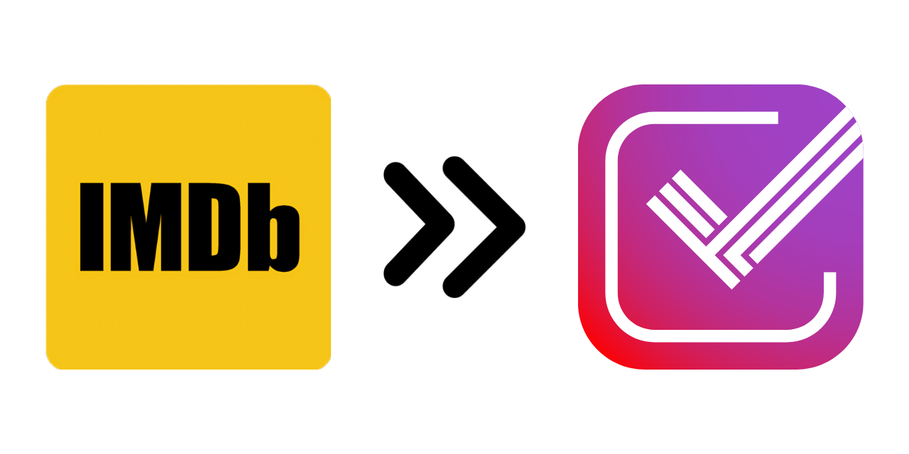

# imdb-trakt-sync

Command line application that can sync [IMDb](https://www.imdb.com/) and [Trakt](https://trakt.tv/dashboard) user data - watchlist, lists, ratings and history.  
To achieve its goals the application is using the [Trakt API](https://trakt.docs.apiary.io/) and web scraping.  
Keep in mind that this application is performing one-way sync from IMDb to Trakt. This means that any changes made on IMDb will be reflected on Trakt, but not the other way around.

# Configuration

<table>
    <tr>
        <th>FIELD NAME</th>
        <th>DEFAULT VALUE</th>
        <th>ALLOWED VALUES</th>
        <th>DESCRIPTION</th>
    </tr>
    <tr>
        <td>IMDB_AUTH</td>
        <td>cookies</td>
        <td>
            credentials 
            cookies 
            none
        </td>
        <td>
            Authentication method to be used for IMDb: 
            <code>credentials</code> => IMDB_EMAIL + IMDB_PASSWORD field required 
            <code>cookies</code> => IMDB_COOKIEATMAIN + IMDB_COOKIEUBIDMAIN fields required 
            <code>none</code> => IMDB_LISTS field required
        </td>
    </tr>
    <tr>
        <td>IMDB_EMAIL</td>
        <td>-</td>
        <td>-</td>
        <td>IMDb account email address. Only required when IMDB_AUTH => <code>credentials</code></td>
    </tr>
    <tr>
        <td>IMDB_PASSWORD</td>
        <td>-</td>
        <td>-</td>
        <td>IMDb account password. Only required when IMDB_AUTH => <code>credentials</code></td>
    </tr>
    <tr>
        <td>IMDB_COOKIEATMAIN</td>
        <td>-</td>
        <td>-</td>
        <td>
            Cookie value only required when IMDB_AUTH => <code>cookies</code>. Get the following cookie information from
            your browser: 
            <code>name: at-main | domain: .imdb.com</code>
        </td>
    </tr>
    <tr>
        <td>IMDB_COOKIEUBIDMAIN</td>
        <td>-</td>
        <td>-</td>
        <td>
            Cookie value required when IMDB_AUTH => <code>cookies</code>. Get the following cookie information from your
            browser: 
            <code>name: ubid-main | domain: .imdb.com</code>
        </td>
    </tr>
    <tr>
        <td>IMDB_LISTS</td>
        <td>-</td>
        <td>-</td>
        <td>
            Array of IMDb list IDs that you would like synced to Trakt. If this array is not specified or empty, all
            IMDb lists on your account will be synced to Trakt. In order to get the ID of an IMDb list, open it from a
            browser - the ID is in the URL with format <code>ls#########</code>. If provided as GitHub secret or
            environment variable, define its values as comma-separated list. Keep in mind the <a
                href="https://forums.trakt.tv/t/personal-list-updates/10170#limits-3">Trakt list limits</a>!
        </td>
    </tr>
    <tr>
        <td>IMDB_TRACE</td>
        <td>false</td>
        <td>
            true 
            false
        </td>
        <td>Print tracing logs related to browser activities. Can be useful for debugging purposes</td>
    </tr>
    <tr>
        <td>IMDB_HEADLESS</td>
        <td>true</td>
        <td>
            true 
            false
        </td>
        <td>
            Whether to run the browser in headless mode or not. Only set this to false when running the syncer locally
        </td>
    </tr>
    <tr>
        <td>IMDB_BROWSERPATH</td>
        <td>-</td>
        <td>-</td>
        <td>
            The location of your preferred web browser. If you leave this value empty, the syncer will attempt to lookup
            common browser locations. You can optionally override its value to use a specific browser
        </td>
    </tr>
    <tr>
        <td>SYNC_MODE</td>
        <td>dry-run</td>
        <td>
            full 
            add-only 
            dry-run
        </td>
        <td>
            Sync mode to be used when running the application: 
            <code>full</code> => add Trakt items that don't exist, delete Trakt items that don't exist on IMDb,
            update 
            Trakt items by treating IMDb as the source of truth 
            <code>add-only</code> => add Trakt items that do not exist, but do not delete anything 
            <code>dry-run</code> => identify what Trakt items would be added / deleted / updated
        </td>
    </tr>
    <tr>
        <td>SYNC_HISTORY</td>
        <td>false</td>
        <td>
            true 
            false
        </td>
        <td>Whether to sync history or not. When IMDB_AUTH => <code>none</code>, history sync will be skipped</td>
    </tr>
    <tr>
        <td>SYNC_RATINGS</td>
        <td>true</td>
        <td>
            true 
            false
        </td>
        <td>Whether to sync ratings or not. When IMDB_AUTH => <code>none</code>, ratings sync will be skipped</td>
    </tr>
    <tr>
        <td>SYNC_WATCHLIST</td>
        <td>true</td>
        <td>
            true 
            false
        </td>
        <td>Whether to sync watchlist or not. When IMDB_AUTH => <code>none</code>, watchlist sync will be skipped</td>
    </tr>
    <tr>
        <td>SYNC_LISTS</td>
        <td>true</td>
        <td>
            true 
            false
        </td>
        <td>Whether to sync lists or not. This provides the option to disable syncing of lists</td>
    </tr>
    <tr>
        <td>SYNC_TIMEOUT</td>
        <td>15m</td>
        <td>-</td>
        <td>
            Maximum duration to run the syncer. Users with large libraries might have to increase the timeout value
            accordingly. Valid time units are: ns, us (or µs), ms, s, m, h
        </td>
    </tr>
    <tr>
        <td>TRAKT_CLIENTID</td>
        <td>-</td>
        <td>-</td>
        <td>Trakt app client ID</td>
    </tr>
    <tr>
        <td>TRAKT_CLIENTSECRET</td>
        <td>-</td>
        <td>-</td>
        <td>Trakt app client secret</td>
    </tr>
    <tr>
        <td>TRAKT_EMAIL</td>
        <td>-</td>
        <td>-</td>
        <td>Trakt account email address (do NOT confuse with username)</td>
    </tr>
    <tr>
        <td>TRAKT_PASSWORD</td>
        <td>-</td>
        <td>-</td>
        <td>Trakt account password</td>
    </tr>
</table>

# Usage

The application can be setup to run automatically, based on a custom schedule (_default: once every 12 hours_) using **GitHub Actions**, in a container, or locally on your machine.  
Workflow schedules can be tweaked by editing the [.github/workflows/sync.yaml](.github/workflows/sync.yaml) file and committing the changes.  
Please configure the application to suits your needs, by referring to the [Configuration](#configuration) section, before running it.  
Follow the relevant section below, based on how you want to use the application.

## Run the application using GitHub Actions

1. [Fork the repository](https://github.com/cecobask/imdb-trakt-sync/fork) to your account
2. Create a [Trakt App](https://trakt.tv/oauth/applications). Use **urn:ietf:wg:oauth:2.0:oob** as redirect uri
3. Configure the application:
   - Open your fork repository on GitHub
   - Create an individual repository secret for each [Configuration](#configuration) field you need: `Settings` > `Secrets and variables` > `Actions` > `New repository secret`
4. Allow GitHub Actions on your fork repository: `Settings` > `Actions` > `General` > `Allow all actions and reusable workflows`
5. Enable the **sync** workflow: `Actions` > `Workflows` > `sync` > `Enable workflow`
6. Run the **sync** workflow manually: `Actions` > `Workflows` > `sync` > `Run workflow`
7. From now on, GitHub Actions will automatically trigger the **sync** workflow based on your schedule

## Run the application in a Docker container

1. Install [Docker](https://www.docker.com/get-started)
2. Clone the repository: `git clone git@github.com:cecobask/imdb-trakt-sync.git`
3. Create a [Trakt App](https://trakt.tv/oauth/applications). Use **urn:ietf:wg:oauth:2.0:oob** as redirect uri
4. Configure the application:
   - Create `.env` file with the same contents as [.env.example](.env.example)
   - Populate the `.env` file with your own secret values
   - All secret keys should have `ITS_` prefix
5. Open a terminal window in the repository folder and then:
   - Build a Docker image: `make package`
   - Run the sync workflow in a Docker container: `make sync-container`

## Run the application locally

1. Install [Git](https://git-scm.com/downloads) and [Go](https://go.dev/doc/install)
2. Clone the repository: `git clone git@github.com:cecobask/imdb-trakt-sync.git`
3. Create a [Trakt App](https://trakt.tv/oauth/applications). Use **urn:ietf:wg:oauth:2.0:oob** as redirect uri
4. Open a terminal window in the repository folder and then:
   - Build the syncer: `make build`
   - Configure the syncer: `make configure`
   - Run the syncer: `make sync`
