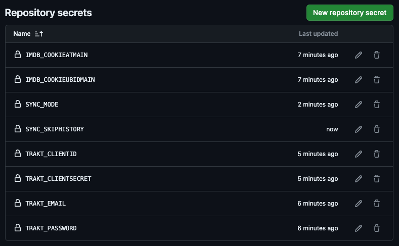

# imdb-trakt-sync
Command line application that can sync [IMDb](https://www.imdb.com/) and [Trakt](https://trakt.tv/dashboard) user data -
watchlist, lists, ratings and history.  
To achieve its goals the application is using the [Trakt API](https://trakt.docs.apiary.io/) and web scraping the IMDb website.  
Keep in mind that this application is performing a one-way sync from IMDb to Trakt.  
There are 3 possible modes to run this application and more details can be found in the [config](config.yaml) file.  
As much as I wanted to provide two-way sync functionality, this will not be possible until IMDb provides a public API.

# Usage
The application can be setup to run automatically, based on a custom schedule (_default: once every 3 hours_) using 
`GitHub Actions` or locally on your machine. Follow the relevant section below, based on how you want to use the application. 

## Run the application using GitHub Actions
1. [Fork the repository](https://github.com/cecobask/imdb-trakt-sync/fork) to your account
2. [Create a Trakt API application](https://trakt.tv/oauth/applications). Give it a name and use `urn:ietf:wg:oauth:2.0:oob` 
as redirect uri. The rest of the fields can be left empty.
3. Configure the application:
   - Open your fork repository on GitHub
   - Create an individual repository secret for each [configuration](config.yaml) parameter: `Settings` > 
   `Secrets and variables` > `Actions` > `New repository secret`
   - The secret names should match the configuration parameter paths. For example, to configure your Trakt email, the 
   secret name should be `TRAKT_EMAIL`
   - The repository secrets dashboard should look similar to this:
4. Enable GitHub Actions for the fork repository
5. Enable the `sync` workflow, as scheduled workflows are disabled by default in fork repositories
6. The `sync` workflow can be triggered manually right away to test if it works. Alternatively, wait for GitHub actions 
to automatically trigger it every 3 hours

## Run the application locally
1. Clone the repository to your machine
2. [Create a Trakt API application](https://trakt.tv/oauth/applications). Give it a name and use `urn:ietf:wg:oauth:2.0:oob` as redirect uri. The rest 
of the fields can be left empty
3. Replace the parameter values in the [configuration](config.yaml) file or set up environment variables that
match the configuration paths, prefixed with `ITS_`. For example, to configure your Trakt email, the environment variable name should be `ITS_TRAKT_EMAIL`
4. Make sure you have Go installed on your machine. If you do not have it, [this is how you can install it](https://go.dev/doc/install)
5. Open a terminal window in the repository folder and run the application using the command `make sync`