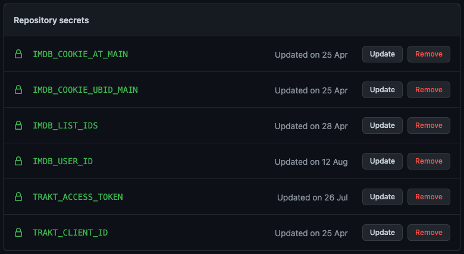

  
# imdb-trakt-sync
GoLang app that can sync [IMDb](https://www.imdb.com/) and [Trakt](https://trakt.tv/dashboard) user data - watchlist, 
lists, ratings and history.  
To achieve its goals the application is using the [Trakt API](https://trakt.docs.apiary.io/) and web scraping the IMDb website.  
Keep in mind that this application is performing a one-way sync from IMDb to Trakt. This means that anything you change 
in IMDb will be reflected on Trakt. However, anything you change in Trakt will be overwritten by the state you have in IMDb.  
As much as I wanted to provide a two-way sync functionality, this will not be possible until IMDb decides to expose a public API.

# Usage
The application can be setup to run automatically, based on a custom schedule (_default: once every 3 hours_) using 
`GitHub Actions` or locally on your machine. Follow the relevant section below, based on how you want to use the application. 

## Run the application using GitHub Actions
1. [Fork the repository](https://github.com/cecobask/imdb-trakt-sync/fork) to your account
2. [Create a Trakt API application](https://trakt.tv/oauth/applications). Give it a name and use `urn:ietf:wg:oauth:2.0:oob`
   as redirect uri. The rest of the fields can be left empty.
3. Configure GitHub repository secrets:
   - All the secrets (a.k.a. environment variables) are listed in the [.env.example](.env.example) file
   - Open the repository secrets dashboard of your fork
   - Create repository secrets: `Settings` > `Secrets` > `Actions` > `New repository secret`
   - Repeat the previous step for each secret individually
   - The repository secrets dashboard should look similar to this:
4. Enable GitHub Actions for the fork repository
5. Enable the `sync` workflow, as scheduled workflows are disabled by default in fork repositories
6. The `sync` workflow can be triggered manually right away to test if it works. Alternatively, wait for GitHub actions 
to automatically trigger it every 3 hours

## Run the application locally
1. Clone the repository to your machine
2. [Create a Trakt API application](https://trakt.tv/oauth/applications). Give it a name and use `urn:ietf:wg:oauth:2.0:oob`
   as redirect uri. The rest of the fields can be left empty.
3. Make a copy of the [.env.example](.env.example) file and name it `.env`
4. Populate all the environment variables in that file using the existing values as reference
5. Make sure you have GoLang installed on your machine. If you do not have it, [this is how you can install it](https://go.dev/doc/install).
6. Open a terminal window in the repository folder and run the application using the command `go run cmd/imdb-trakt-sync/main.go`